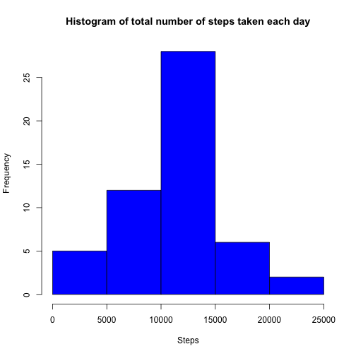
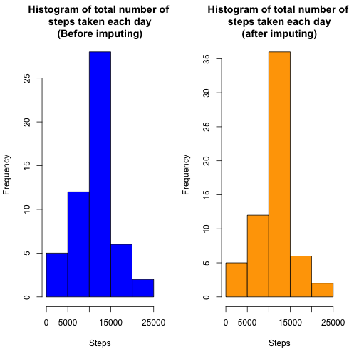
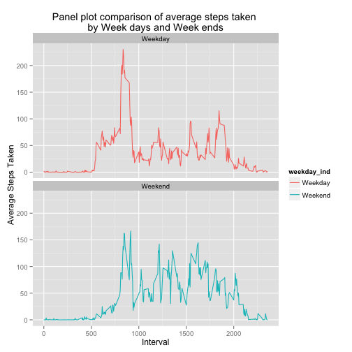

# Reproducible Research: Peer Assessment 1


## Loading and preprocessing the data

1) Load the data


```r
#Load activity file
unzip(zipfile = "activity.zip",files = "activity.csv")
#Read 'date' variable as strings instead of converting as factors
activity_monitoring <- read.csv("activity.csv",stringsAsFactors=FALSE)
#Remove input file from /tmp once reading is done
file.remove("activity.csv")
```

2) Process/transform data(if necessary) into a format suitable for analysis

one simple transformation is converting "date" variable from character to date datatype


```r
#Converting 'date' variable from character to date
activity_monitoring$date <- as.Date(activity_monitoring$date)
#Checking summary of input data to understand data
summary(activity_monitoring)
```

```
##      steps            date               interval   
##  Min.   :  0.0   Min.   :2012-10-01   Min.   :   0  
##  1st Qu.:  0.0   1st Qu.:2012-10-16   1st Qu.: 589  
##  Median :  0.0   Median :2012-10-31   Median :1178  
##  Mean   : 37.4   Mean   :2012-10-31   Mean   :1178  
##  3rd Qu.: 12.0   3rd Qu.:2012-11-15   3rd Qu.:1766  
##  Max.   :806.0   Max.   :2012-11-30   Max.   :2355  
##  NA's   :2304
```

```r
#Observation : 2304 missing values in "steps"
```

## What is mean total number of steps taken per day?

1) Histogram of the total number of steps taken each day


```r
#Ignoring missing values.
total_steps_per_day <- aggregate(steps ~ date, data=activity_monitoring, sum,na.rm = T)
hist(total_steps_per_day$steps,main="Histogram of total number of steps taken each day", xlab="Steps", col="blue")
```

 


2) Calculating mean of the total steps taken per day. Median calculation follows next.


```r
#Ignoring missing values. calculate mean of the total steps taken per day
mean(total_steps_per_day$steps,na.rm=T)
```

```
## [1] 10766
```

2) Calculating median of the total steps taken per day


```r
#Ignoring missing values. calculate median of the total steps taken per day
median(total_steps_per_day$steps,na.rm=T)
```

```
## [1] 10765
```


## What is the average daily activity pattern?

1) A time series plot (i.e. type = "l") of the 5-minute interval (x-axis) and the average number of steps taken, averaged across all days (y-axis)


```r
#Aggregate to find average number of steps taken by interval
aggr_by_interval <- aggregate(steps ~ interval,data=activity_monitoring, mean,na.rm = T)
#Time Series Plot
with(aggr_by_interval, plot(steps~interval, type="l", xlab="Interval", ylab="Avg number of steps taken", main="Time series plot", col="red"))
```

 

2) Which 5-minute interval, on average across all the days in the dataset, contains the maximum number of steps?


```r
max_steps <- aggr_by_interval[which.max(aggr_by_interval$steps),]
print("Following interval has maximum number of averaging steps by interval across all the days in dataset")
```

```
## [1] "Following interval has maximum number of averaging steps by interval across all the days in dataset"
```

```r
print(max_steps$interval)
```

```
## [1] 835
```


## Imputing missing values

1) Calculate and report the total number of missing values in the dataset (i.e. the total number of rows with NAs)


```r
sapply(X = activity_monitoring,function (x) { sum(is.na(x))})
```

```
##    steps     date interval 
##     2304        0        0
```

```r
#There are about 2304 missing values in steps
```

2) Devising a strategy for filling in all of the missing values in the dataset. 

I've chosen mean for 5 minute interval and impute on the missing values. 


```r
#Using arrange & ddply functions from plyr
library(plyr)

#Imputing missing values in "steps" - New variable called "imputed_steps" is added without disturbing
#existing column. This is helpful to check quality of imputed values. Imputed_steps attribute will
#be used for all further analysis

temp_df <- ddply(activity_monitoring, "interval", transform, imputed_steps=ifelse(is.na(steps), round(mean(steps,na.rm=T)), steps))

#Sort data frame by interval and date to maintain in the original format order
imputed_activity_monitoring <- arrange(temp_df, date, interval)
#Dropping temp dataframe
rm(temp_df)
```

3) New data set has been created already with imputed missing values using above strategy [mean for 5 minute interval]. Just displaying header rows to check the data set


```r
head(imputed_activity_monitoring)
```

```
##   steps       date interval imputed_steps
## 1    NA 2012-10-01        0             2
## 2    NA 2012-10-01        5             0
## 3    NA 2012-10-01       10             0
## 4    NA 2012-10-01       15             0
## 5    NA 2012-10-01       20             0
## 6    NA 2012-10-01       25             2
```

4) Making a histogram of the total number of steps taken each day and Calculate and report the mean and median total number of steps taken per day.


```r
#wanted to use ddply instead of aggregate to get total number of steps taken each day
imputed_total_steps_per_day <- ddply(imputed_activity_monitoring,"date",summarise,tot_steps=sum(imputed_steps))
hist(imputed_total_steps_per_day$tot_steps,main="Histogram of total number of steps taken each day(after imputing)", xlab="Steps", col="orange")
```

 

Additionaly, I am creating Side by side comparison of histogram which should yield good interpreation of histograms


```r
par(mfcol = c(1,2))
hist(total_steps_per_day$steps,main="Histogram of total number of \nsteps taken each day\n(Before imputing)", xlab="Steps", col="blue")
hist(imputed_total_steps_per_day$tot_steps,main="Histogram of total number of \nsteps taken each day\n(after imputing)", xlab="Steps", col="orange")
```

 

```r
par(mfcol = c(1,1))
```

Calculating mean of the total steps taken per day


```r
mean(imputed_total_steps_per_day$tot_steps)
```

```
## [1] 10766
```

calculating medain of the total steps taken per day


```r
median(imputed_total_steps_per_day$tot_steps)
```

```
## [1] 10762
```

**Results:** *From the above observations, imputed values did not affect shape of histogram much, but there is a little difference in height of the histogram. When there is no change in the mean, Median changed little bit. I am presuming that impute values did not disturb pattern of data much. I believe that is good*

## Are there differences in activity patterns between weekdays and weekends?

1) Creating a new factor variable "weekday_ind" with two levels - "Weekday" & "Weekend"

```r
#Adding weekday indicator with existing dataset
imputed_activity_monitoring <- ddply(imputed_activity_monitoring,"date",transform,weekday_ind= ifelse(weekdays(date) %in% c("Saturday","Sunday"),"Weekend","Weekday"))

#Averaging steps by weekday_ind and interval
avg_weekly_activity <- ddply(imputed_activity_monitoring, c("interval","weekday_ind"),summarise, avg_steps = mean(imputed_steps))
```

2) Making a panel plot containing a time series plot (i.e. type = "l") of the 5-minute interval (x-axis) and the average number of steps taken, averaged across all weekday days or weekend days (y-axis). 

My choice here is ggplot2 graphical system


```r
library(ggplot2)

ggplot(data=avg_weekly_activity, aes(x=interval,y=avg_steps, colour=weekday_ind), ) + geom_line() + facet_wrap(~weekday_ind,nrow=2) + xlab("Interval") + ylab("Average Steps Taken") + ggtitle("Panel plot comparison of average steps taken \nby Week days and Week ends")
```

 

**Results:** *My interpretation by comparing weekday and weekend plots - People are active mostly in weekends. I do see several average steps peeks in weekend after 1000 minutes interval. However, people are active in weekdays than weekend on specific interval, that is, between 750 to 900 minutes approximately*


